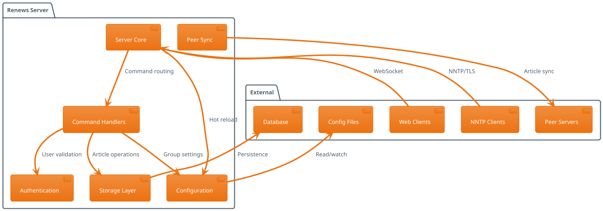

# Renews Architecture

This document describes the architecture and design of the Renews NNTP server.

## Overview

Renews is designed as a modular NNTP server with clear separation of concerns between different components. The architecture follows Rust best practices with async/await for concurrent connection handling and trait-based abstractions for pluggable storage backends.

## Core Components

### Server Core (`src/server.rs`)
The main server component that handles:
- TCP connection acceptance 
- TLS connection management
- WebSocket bridge coordination
- Configuration hot-reloading
- Graceful shutdown

### Command Handlers (`src/handlers/`)
NNTP protocol implementation organized by functionality:
- **Article handlers** (`article.rs`) - ARTICLE, HEAD, BODY, STAT commands
- **Authentication** (`auth.rs`) - AUTHINFO USER/PASS commands  
- **Group management** (`group.rs`) - GROUP, LIST, LISTGROUP commands
- **Information** (`info.rs`) - CAPABILITIES, HELP, DATE commands
- **Article posting** (`post.rs`) - POST, IHAVE commands
- **Streaming** (`streaming.rs`) - CHECK, TAKETHIS for high-volume feeds
- **Utilities** (`utils.rs`) - Common handler functionality

### Storage Layer (`src/storage/`)
Pluggable storage backends with async trait abstraction:
- **SQLite backend** (`sqlite.rs`) - Default file-based storage
- **PostgreSQL backend** (`postgres.rs`) - Full-featured database storage
- **Common utilities** (`common.rs`) - Shared storage functionality

### Authentication (`src/auth/`)
User authentication and authorization system:
- Password hashing with Argon2
- Role-based access (admin, moderator, user)
- Per-group moderation permissions

### Configuration (`src/config.rs`)
Runtime configuration management:
- TOML-based configuration files
- Environment variable substitution
- File content inclusion
- Hot-reload capability

### Peer Synchronization (`src/peers.rs`)
Distributed newsgroup synchronization:
- Configurable sync intervals
- Wildcard pattern matching for group selection
- Incremental article transfer
- Connection pooling and retry logic

## System Interactions

## Request Flow

### Client Connection Flow
1. **Connection Acceptance** - Server accepts TCP/TLS connection
2. **Protocol Negotiation** - Send initial greeting, handle MODE READER
3. **Authentication** - Process AUTHINFO commands if required
4. **Command Processing** - Parse and route NNTP commands to handlers
5. **Response Generation** - Format and send RFC-compliant responses

### Article Storage Flow
1. **Article Reception** - Receive article via POST or IHAVE
2. **Validation** - Check size limits, moderation requirements
3. **Processing** - Parse headers, generate Message-ID if needed
4. **Storage** - Persist to database with group associations
5. **Distribution** - Queue for peer synchronization if applicable

### Peer Synchronization Flow
1. **Schedule Check** - Timer-based sync interval triggers
2. **Group Enumeration** - List groups matching peer patterns
3. **Incremental Sync** - Fetch articles since last sync timestamp
4. **Transfer** - Use IHAVE/CHECK/TAKETHIS for efficient transfer
5. **State Update** - Record last sync time for next iteration

## Concurrency Model

Renews uses Tokio's async runtime for concurrent connection handling:

- **Connection Tasks** - Each client connection runs in its own async task
- **Background Tasks** - Peer sync and retention cleanup run as background tasks
- **Shared State** - Configuration and storage are shared via Arc<RwLock<>> 
- **Database Pooling** - Connection pools manage database access concurrency

## Database Schema

### SQLite Schema
- **messages** - Article content and metadata
- **group_articles** - Group membership and numbering
- **groups** - Group definitions and settings
- **users** - Authentication data (auth database)
- **peers** - Peer synchronization state (peer database)

### PostgreSQL Schema
Similar schema with PostgreSQL-specific optimizations:
- Native timestamp types
- Better indexing strategies
- Connection pooling

## Security Considerations

- **Authentication** - Argon2 password hashing
- **TLS Support** - Configurable certificate-based encryption
- **Input Validation** - Strict NNTP protocol parsing
- **SQL Injection** - Parameterized queries throughout
- **Resource Limits** - Configurable article size and retention limits

## Performance Characteristics

- **Memory Usage** - Streaming article processing, minimal buffering
- **Database I/O** - Efficient indexing and query patterns
- **Network I/O** - Async connection handling scales to thousands of clients
- **Storage Growth** - Automatic retention-based cleanup