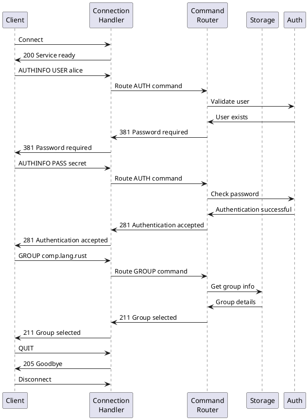
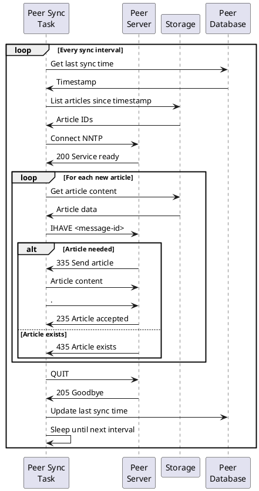

# Task Interactions and System Flows

This document describes the different types of tasks in Renews and how they interact with each other and external services.

## Task Types Overview

Renews implements several concurrent task types that work together to provide a complete NNTP service:

1. **Connection Handler Tasks** - Handle individual client connections
2. **Network Listener Tasks** - Accept new connections (TCP, TLS, WebSocket)
3. **Peer Synchronization Tasks** - Distribute articles with other servers
4. **Maintenance Tasks** - Background cleanup and housekeeping
5. **Configuration Management** - Hot configuration reloading
6. **Administrative Tasks** - CLI-based administration

## System Architecture Diagram

```plantuml
@startuml
!theme aws-orange

title Renews NNTP Server - Task Interactions

package "External Clients" {
  [NNTP Clients] as clients
  [Web Clients] as webclients
}

package "External Services" {
  [Peer NNTP Servers] as peers
  [Database Systems] as database
  [File System] as filesystem
}

package "Renews Server Process" {
  
  rectangle "Network Layer" {
    [TCP Listener] as tcplistener
    [TLS Listener] as tlslistener
    [WebSocket Bridge] as wsbridge
  }
  
  rectangle "Connection Handlers" {
    [Client Handler 1] as handler1
    [Client Handler 2] as handler2
    [Client Handler N] as handlerN
  }
  
  rectangle "Background Tasks" {
    [Peer Sync Task 1] as peertask1
    [Peer Sync Task 2] as peertask2
    [Retention Cleanup] as cleanup
    [Config Reloader] as configreload
  }
  
  rectangle "Core Components" {
    [Storage Engine] as storage
    [Authentication] as auth
    [Configuration] as config
    [Command Handlers] as cmdhandlers
  }
  
  rectangle "Administrative Interface" {
    [CLI Admin] as admin
  }
}

' External connections
clients --> tcplistener : NNTP (port 119)
clients --> tlslistener : NNTPS (port 563)
webclients --> wsbridge : WebSocket (port 8080)

' Listener to handler connections  
tcplistener --> handler1 : spawn connection
tlslistener --> handler2 : spawn TLS connection
wsbridge --> handlerN : spawn WebSocket connection

' Handler interactions
handler1 --> cmdhandlers : route commands
handler2 --> cmdhandlers : route commands
handlerN --> cmdhandlers : route commands

cmdhandlers --> storage : CRUD operations
cmdhandlers --> auth : user validation
cmdhandlers --> config : group policies

' Background task interactions
peertask1 --> peers : article sync
peertask2 --> peers : article sync
peertask1 --> storage : read/write articles
peertask2 --> storage : read/write articles

cleanup --> storage : delete expired articles
cleanup --> config : retention policies

configreload --> config : reload settings
configreload --> filesystem : watch config file

' Storage and auth interactions
storage --> database : persist data
auth --> database : user data

' Admin interface
admin --> storage : manage groups
admin --> auth : manage users
admin --> config : read settings

' Configuration distribution
config --> handler1 : settings
config --> handler2 : settings
config --> handlerN : settings
config --> peertask1 : peer config
config --> peertask2 : peer config
config --> cleanup : retention config

@enduml
```

## Task Lifecycle and Interactions

### 1. Connection Handler Tasks

**Purpose**: Handle individual client NNTP sessions

**Lifecycle**:
1. Spawned when new connection is accepted by listener
2. Handles authentication if required
3. Processes NNTP commands in request/response loop
4. Terminates when client disconnects or times out

**Interactions**:
- **Storage Engine**: Store/retrieve articles and group information
- **Authentication**: Validate user credentials and permissions
- **Configuration**: Check group policies and limits
- **Command Handlers**: Delegate protocol-specific operations

**Concurrency**: Hundreds to thousands of tasks running simultaneously

### 2. Network Listener Tasks

**Purpose**: Accept new network connections

**Types**:
- **TCP Listener**: Plain NNTP connections (port 119)
- **TLS Listener**: Encrypted NNTP connections (port 563)  
- **WebSocket Bridge**: WebSocket-based NNTP for web clients

**Lifecycle**:
1. Started during server initialization
2. Bind to configured network addresses
3. Run infinite accept loop
4. Spawn connection handler task for each accepted connection

**Interactions**:
- **Connection Handlers**: Spawn new tasks for each connection
- **Configuration**: Read listen addresses and TLS settings

### 3. Peer Synchronization Tasks

**Purpose**: Distribute articles with other NNTP servers

**Lifecycle**:
1. One task spawned per configured peer server
2. Periodic wake-up based on sync interval
3. Connect to peer server using NNTP protocol
4. Transfer new articles since last sync
5. Update sync timestamp and sleep until next interval

**Interactions**:
- **Peer Servers**: Outbound NNTP connections for article transfer
- **Storage Engine**: Read local articles, store received articles
- **Configuration**: Peer settings, sync intervals, group patterns
- **Peer Database**: Track sync state and timestamps

**Transfer Modes**:
- **Streaming Mode**: High-volume feeds using CHECK/TAKETHIS
- **Traditional Mode**: Lower-volume feeds using IHAVE

### 4. Maintenance Tasks

**Purpose**: Background housekeeping and cleanup

**Types**:

#### Retention Cleanup Task
- **Function**: Remove expired articles based on retention policies
- **Schedule**: Periodic execution (typically daily)
- **Process**:
  1. Query all newsgroups
  2. Apply retention rules (time-based and Expires header)
  3. Delete expired articles from storage
  4. Clean up orphaned message records

#### Database Maintenance
- **Function**: Optimize database performance
- **Operations**: VACUUM, ANALYZE for SQLite; table maintenance for PostgreSQL

**Interactions**:
- **Storage Engine**: Delete operations and database optimization
- **Configuration**: Retention policies and cleanup schedules

### 5. Configuration Management

**Purpose**: Hot configuration reloading without service restart

**Mechanism**:
- Signal handler listening for SIGHUP
- File watcher for configuration changes
- Runtime application of new settings

**Reloadable Settings**:
- Article retention policies
- Group-specific settings  
- TLS certificates
- Peer configurations

**Non-reloadable Settings**:
- Network listen addresses
- Database connection strings
- Feature flags (WebSocket, PostgreSQL)

**Process**:
1. Receive SIGHUP signal or detect file change
2. Parse new configuration file
3. Validate configuration
4. Update runtime settings atomically
5. Restart affected peer tasks if needed
6. Reload TLS certificates

### 6. Administrative Tasks

**Purpose**: Management operations without server restart

**Operations**:
- User management (add/remove users, set admin/moderator privileges)
- Group management (create/remove newsgroups)
- Database initialization

**Execution**: Command-line interface, runs independently of server

## Inter-Task Communication

### Shared State Management

**Configuration**: `Arc<RwLock<Config>>`
- Shared read access for most operations
- Write access only during configuration reload
- Ensures consistent view of settings across all tasks

**Storage Engine**: `Arc<dyn Storage>`
- Thread-safe database connection pooling
- Concurrent read/write operations
- Atomic transactions for consistency

**Authentication**: `Arc<dyn AuthProvider>`
- Shared user credential storage
- Concurrent authentication requests
- Role-based access control

### Task Coordination Patterns

1. **Spawn and Forget**: Network listeners spawn connection handlers
2. **Periodic Execution**: Peer sync and cleanup tasks with timer-based scheduling
3. **Event-Driven**: Configuration reload triggered by signals
4. **Resource Sharing**: All tasks share storage and configuration through Arc

### Error Handling and Resilience

- **Task Isolation**: Failure in one connection handler doesn't affect others
- **Automatic Restart**: Peer sync tasks restart after connection failures
- **Graceful Degradation**: TLS failures fall back to plain text warnings
- **Resource Cleanup**: Proper cleanup when tasks terminate

## Performance Characteristics

**Scalability**:
- Connection handlers scale to thousands of concurrent clients
- Peer sync tasks run independently without blocking main service
- Background maintenance runs during low-usage periods

**Resource Usage**:
- Memory: Minimal per-connection overhead with streaming processing
- CPU: Efficient async I/O with Tokio runtime
- Database: Connection pooling and prepared statements
- Network: Concurrent handling with proper backpressure

**Monitoring Points**:
- Active connection count
- Peer sync success/failure rates
- Article retention cleanup statistics
- Database query performance
- Memory and CPU utilization per task type

This architecture provides a robust, scalable NNTP server that can handle high-volume article feeds while maintaining good performance for interactive client connections.